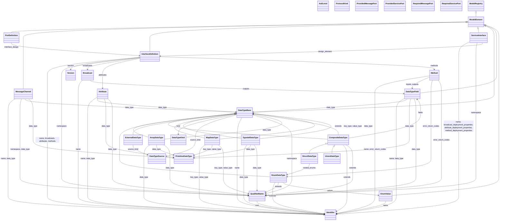

<!----
*******************************************************************************
Copyright (c) 2026 Contributors to the Eclipse Foundation

See the NOTICE file(s) distributed with this work for additional
information regarding copyright ownership.

This program and the accompanying materials are made available under the
terms of the Apache License Version 2.0 which is available at
https://www.apache.org/licenses/LICENSE-2.0

SPDX-License-Identifier: Apache-2.0
*******************************************************************************
-->

# ECU Model Reference

<!-- Generated by tools/docgen:generate_model_docs. Do not edit manually,
     update the docstrings in the sources and regenerate instead. -->

## Overview

Inheritance (`<|--`) and references between the documented types; members are omitted on purpose.

## `score.ecu_model.common.asil_level`

### `AsilLevel`

Inherits from `str`, `Enum`.

ISO 26262 Automotive Safety Integrity Level.

**Members**

| Member | Value |
| --- | --- |
| `QM` | `'QM'` |
| `A` | `'ASIL-A'` |
| `B` | `'ASIL-B'` |
| `C` | `'ASIL-C'` |
| `D` | `'ASIL-D'` |

## `score.ecu_model.common.version`

### `Version`

Inherits from `BaseModel`.

Semantic version shared by ECU model objects.

**Fields**

| Field | Type | Default | Description |
| --- | --- | --- | --- |
| `major` | `int` | `1` |  |
| `minor` | `int` | `0` |  |
| `patch` | `int` | `0` |  |

**Validators**

| Validator | Kind | Applies to | Description |
| --- | --- | --- | --- |
| `_validate_decimal_integer` | field, before | `major`, `minor`, `patch` | Validates `major`, `minor`, `patch`. |
| `_validate_all_or_none_provided` | model, before | _the whole model_ | Validates the model as a whole. |
| `_validate_at_least_one_non_zero` | model, after | _the whole model_ | Validates the model as a whole. |

#### `__gt__(self, other)`

_method_

Return a > b.  Computed by @total_ordering from (not a < b) and (a != b).

#### `__le__(self, other)`

_method_

Return a <= b.  Computed by @total_ordering from (a < b) or (a == b).

#### `__ge__(self, other)`

_method_

Return a >= b.  Computed by @total_ordering from (not a < b).

## `score.ecu_model.communication.detail.service_port`

### `PortDefinition`

Inherits from [`ModelElement`](#modelelement).

Binding-independent declaration of a service port.

**Fields**

| Field | Type | Default | Description |
| --- | --- | --- | --- |
| `interface_design` | [`InterfaceDefinition`](#interfacedefinition) | _required_ | Binding-independent service interface declared by this port |

## `score.ecu_model.communication.message_channel`

### `MessageChannel`

Inherits from [`ModelElement`](#modelelement).

Represents a communication channel for message-oriented ports.

**Fields**

| Field | Type | Default | Description |
| --- | --- | --- | --- |
| `name` | [`Identifier`](#identifier) | _required_ | Identifier of the message channel |
| `namespace` | [`QualifiedName`](#qualifiedname) | `QualifiedName()` | Namespace of the message channel |
| `data_type` | [`PrimitiveDataType`](#primitivedatatype) \| [`DataTypeBase`](#datatypebase) \| [`Identifier`](#identifier) \| [`QualifiedName`](#qualifiedname) | _required_ | Payload data type carried by this channel |
| `channel_id` | `int \| None` | `None` | Optional unique identifier for the message channel from the deployment |

## `score.ecu_model.communication.message_port`

### `ProvidedMessagePort`

Inherits from `_MessagePort`.

A message port offered by an application or activity.

**Fields**

| Field | Type | Default | Description |
| --- | --- | --- | --- |
| `max_published_messages` | `int` | `1` | Max output queue size |

### `RequiredMessagePort`

Inherits from `_MessagePort`.

A message port consumed by an application or activity.

**Fields**

| Field | Type | Default | Description |
| --- | --- | --- | --- |
| `max_required_messages` | `int` | `1` | Max input queue size, window size regarding all messages published by the producer |

## `score.ecu_model.communication.protocol`

### `ProtocolKind`

Inherits from `str`, `Enum`.

Discriminator values for concrete communication binding models.

**Members**

| Member | Value |
| --- | --- |
| `ARA_COM` | `'ARA::COM'` |
| `ARA_DIAG` | `'ARA::DIAG'` |
| `MW_COM` | `'MW::COM'` |
| `MW_DIAG` | `'MW::DIAG'` |

## `score.ecu_model.communication.service_interface`

### `Broadcast`

Inherits from `BaseModel`.

Named service broadcast / event carrying zero or more output data types.

**Fields**

| Field | Type | Default | Description |
| --- | --- | --- | --- |
| `name` | [`Identifier`](#identifier) | _required_ |  |
| `outputs` | list[[`DataTypeField`](#datatypefield)] | `list()` |  |

### `Attribute`

Inherits from `BaseModel`.

Named service attribute field with access properties.

**Fields**

| Field | Type | Default | Description |
| --- | --- | --- | --- |
| `name` | [`Identifier`](#identifier) | _required_ |  |
| `data_type` | [`PrimitiveDataType`](#primitivedatatype) \| [`DataTypeBase`](#datatypebase) \| [`Identifier`](#identifier) \| [`QualifiedName`](#qualifiedname) | _required_ | Specifies the data type of the attribute |
| `has_getter` | `bool` | `True` | Indicates if the attribute has a getter method |
| `has_setter` | `bool` | `True` | Indicates if the attribute has a setter method |
| `subscribable` | `bool` | `True` | Indicates if the attribute can be subscribed to |

### `Method`

Inherits from `BaseModel`.

Named service method with input, output, and error definitions.

**Fields**

| Field | Type | Default | Description |
| --- | --- | --- | --- |
| `name` | [`Identifier`](#identifier) | _required_ |  |
| `inputs` | list[[`DataTypeField`](#datatypefield)] | `list()` | Specifies the input data types of the method |
| `outputs` | list[[`DataTypeField`](#datatypefield)] | `list()` | Specifies the output data types of the method |
| `error_return_codes` | [`EnumDataType`](#enumdatatype) \| [`Identifier`](#identifier) \| [`QualifiedName`](#qualifiedname) \| None | `None` | Specifies the error return codes of the method |
| `fire_and_forget` | `bool` | `False` | Indicates if the method requires acknowledgment on bus level |

### `InterfaceDefinition`

Inherits from [`ModelElement`](#modelelement).

Reusable design-time declaration of an interface.

**Fields**

| Field | Type | Default | Description |
| --- | --- | --- | --- |
| `name` | [`Identifier`](#identifier) | _required_ |  |
| `namespace` | [`QualifiedName`](#qualifiedname) | `QualifiedName()` |  |
| `version` | [`Version`](#version) | _required_ |  |
| `broadcasts` | dict[[`Identifier`](#identifier), [`Broadcast`](#broadcast)] | `dict()` |  |
| `attributes` | dict[[`Identifier`](#identifier), [`Attribute`](#attribute)] | `dict()` |  |
| `methods` | dict[[`Identifier`](#identifier), [`Method`](#method)] | `dict()` |  |

**Validators**

| Validator | Kind | Applies to | Description |
| --- | --- | --- | --- |
| `_coerce_namespace` | model, before | _the whole model_ | Allow for specifying the namespace as a simple dot-separated string instead of a QualifiedName object during construction. |
| `_validate_member_keys` | model, after | _the whole model_ | Validate that the keys of all member dictionaries match the declared member names. |

#### `fully_qualified_name`

_property_

Return the dot-separated interface name.

### `ServiceInterface`

Inherits from [`ModelElement`](#modelelement).

Concrete deployment of an InterfaceDefinition.

**Fields**

| Field | Type | Default | Description |
| --- | --- | --- | --- |
| `name` | [`Identifier`](#identifier) | _required_ |  |
| `namespace` | [`QualifiedName`](#qualifiedname) | `QualifiedName()` |  |
| `design_element` | [`InterfaceDefinition`](#interfacedefinition) | _required_ |  |
| `service_id` | `int \| None` | `None` |  |
| `deployment_properties` | `dict[str, object]` | `dict()` |  |
| `interface_deployment_properties` | `dict[str, object]` | `dict()` |  |
| `broadcast_deployment_properties` | dict[[`Identifier`](#identifier), dict[str, object]] | `dict()` |  |
| `attribute_deployment_properties` | dict[[`Identifier`](#identifier), dict[str, object]] | `dict()` |  |
| `method_deployment_properties` | dict[[`Identifier`](#identifier), dict[str, object]] | `dict()` |  |

**Validators**

| Validator | Kind | Applies to | Description |
| --- | --- | --- | --- |
| `_validate_property_names` | field, after | `deployment_properties`, `interface_deployment_properties`, `broadcast_deployment_properties`, `attribute_deployment_properties`, `method_deployment_properties` | Validates `deployment_properties`, `interface_deployment_properties`, `broadcast_deployment_properties`, `attribute_deployment_properties`, `method_deployment_properties`. |
| `_coerce_namespace` | model, before | _the whole model_ | Allow for specifying the namespace as a simple dot-separated string instead of a QualifiedName object during construction. |
| `_validate_member_deployment_properties` | model, after | _the whole model_ | Validate that all member-specific deployment data references declared members in the interface design element and all declared members are covered by deployment data. |

## `score.ecu_model.communication.service_port`

### `ProvidedServicePort`

Inherits from `_ServicePort`.

A service port offered by an application or activity.

### `RequiredServicePort`

Inherits from `_ServicePort`.

A service port consumed by an application or activity.

## `score.ecu_model.data_types.array`

### `ArrayDataType`

Inherits from [`DataTypeBase`](#datatypebase).

Definition of an array data type with element type and optional dimensions.

**Fields**

| Field | Type | Default | Description |
| --- | --- | --- | --- |
| `kind` | Literal[[`DataTypeKind`](#datatypekind).ARRAY] | `DataTypeKind.ARRAY` |  |
| `data_type` | [`PrimitiveDataType`](#primitivedatatype) \| [`DataTypeBase`](#datatypebase) \| [`Identifier`](#identifier) \| [`QualifiedName`](#qualifiedname) | _required_ | Array element type definition; may temporarily be an unresolved reference during model resolution |
| `is_inline` | `bool` | `False` | Whether the array is declared inline without a type name |
| `dimension_min` | `int \| None` | `None` | Minimum dimension bound |
| `dimension_max` | `int \| None` | `None` | Maximum dimension bound |

**Validators**

| Validator | Kind | Applies to | Description |
| --- | --- | --- | --- |
| `_validate_dimension_bound_is_non_negative` | field, after | `dimension_min`, `dimension_max` | Validate array dimension bounds as non-negative integers when provided. |
| `_validate_array_constraints` | model, after | _the whole model_ | Validate array naming and dimension constraints. |

## `score.ecu_model.data_types.common`

### `DataTypeKind`

Inherits from `str`, `Enum`.

Discriminator values for concrete DataTypeBase models.
Used to distinguish between different kinds of data types in the model when (de-)serializing them.
Primitives are intentionally absent: they are builtin and therefore never declared.

**Members**

| Member | Value |
| --- | --- |
| `ENUM` | `'enum'` |
| `STRUCT` | `'struct'` |
| `UNION` | `'union'` |
| `ARRAY` | `'array'` |
| `MAP` | `'map'` |
| `TYPEDEF` | `'typedef'` |
| `EXTERNAL` | `'external'` |

#### `__str__(self) -> str`

_method_

Return the canonical data type kind name.

### `DataTypeSource`

Inherits from `str`, `Enum`.

IDL (Interface Definition Language) from which the data type originates.

**Members**

| Member | Value |
| --- | --- |
| `FRANCA` | `'franca'` |
| `PROTOBUF` | `'protobuf'` |
| `CPP_HEADER_FILE` | `'cpp_header_file'` |

#### `separator`

_property_

Return the namespace separator used by this source language.

#### `__str__(self) -> str`

_method_

Return the canonical data type source name.

### `DataTypeBase`

Inherits from [`ModelElement`](#modelelement).

Shared metadata for data types that are declared in a source language.

**Fields**

| Field | Type | Default | Description |
| --- | --- | --- | --- |
| `kind` | [`DataTypeKind`](#datatypekind) | _required_ | Discriminator identifying the concrete data type definition kind |
| `source_kind` | [`DataTypeSource`](#datatypesource) | _required_ | Origin of the data type definition, e.g. franca, protobuf, etc. |
| `name` | [`Identifier`](#identifier) \| None | `None` | Identifier of the data type; absent for inline arrays and maps |
| `namespace` | [`QualifiedName`](#qualifiedname) | `QualifiedName()` | Enclosing namespace segments, outer-to-inner |
| `source_uri` | `str \| None` | `None` | Optional source file path which this data type definition was imported from |
| `deployment_properties` | `dict[str, object]` | `dict()` | Deployment properties aggregated from all communication bindings using this data type |

**Validators**

| Validator | Kind | Applies to | Description |
| --- | --- | --- | --- |
| `_validate_source_uri` | field, after | `source_uri` | Validate that source_uri is non-empty and contains no null bytes when provided. |
| `_coerce_name_and_namespace` | model, before | _the whole model_ | Validates the model as a whole. |

#### `model_post_init(self, context: Any, /) -> None`

_method_

Reject direct instantiation of the abstract base type.

#### `fully_qualified_name`

_property_

Return the fully qualified name combining namespace and name.

## `score.ecu_model.data_types.composite`

### `DataTypeField`

Inherits from [`ModelElement`](#modelelement).

A named member of a composite data type, e.g. a struct.

**Fields**

| Field | Type | Default | Description |
| --- | --- | --- | --- |
| `name` | [`Identifier`](#identifier) | _required_ | Identifier of the field in its declaring data type, validated in the using struct or union |
| `data_type` | [`PrimitiveDataType`](#primitivedatatype) \| [`DataTypeBase`](#datatypebase) \| [`Identifier`](#identifier) \| [`QualifiedName`](#qualifiedname) | _required_ | Builtin primitive or reference to the declared data type of the field; may temporarily be an unresolved reference during model resolution |
| `field_number` | `int \| None` | `None` | Optional wire tag defined by the source IDL, e.g. the protobuf field number |
| `optional` | `bool` | `False` | Whether the field may be absent, e.g. a proto2 or Franca optional field |
| `default` | `str \| None` | `None` | Optional default value carried over from the source IDL, serialized as string |
| `deployment_properties` | `dict[str, object]` | `dict()` | Deployment properties aggregated from all communication bindings using this field |

**Validators**

| Validator | Kind | Applies to | Description |
| --- | --- | --- | --- |
| `_reject_non_positive_field_numbers` | field, before | `field_number` | Reject booleans and non-positive numbers so they are not silently accepted as wire tags. |

### `CompositeDataType`

Inherits from [`DataTypeBase`](#datatypebase).

Shared metadata for declared data types that are made up of named fields, i.e. structs and unions.

**Fields**

| Field | Type | Default | Description |
| --- | --- | --- | --- |
| `extends` | [`DataTypeBase`](#datatypebase) \| [`Identifier`](#identifier) \| [`QualifiedName`](#qualifiedname) \| None | `None` | Optional data type definition extended by this data type; may temporarily be an unresolved reference during model resolution |
| `fields` | tuple[[`DataTypeField`](#datatypefield), ...] | `tuple()` | Fields in source declaration order, not changeable after creation |

**Validators**

| Validator | Kind | Applies to | Description |
| --- | --- | --- | --- |
| `_validate_field_definitions` | field, after | `fields` | Validate field definitions and uniqueness. |
| `_validate_inheritance` | field, after | `extends` | Validate the inheritance according to their enclosing source language and kind. |

#### `model_post_init(self, context: 'Any', /) -> 'None'`

_method_

Reject instantiation of this abstract base, before the element is added to the model registry.

## `score.ecu_model.data_types.enum`

### `EnumValue`

Inherits from [`ModelElement`](#modelelement).

A named enum literal with an optional numeric value.

**Fields**

| Field | Type | Default | Description |
| --- | --- | --- | --- |
| `name` | [`Identifier`](#identifier) | _required_ | Identifier of the enum literal in its source namespace |
| `value` | `int \| None` | `None` | Optional numeric value assigned to the enum literal; may be negative, e.g. Franca allows signed enumerator expressions |
| `deployment_properties` | `dict[str, object]` | `dict()` | Deployment properties defined for this enum literal |

**Validators**

| Validator | Kind | Applies to | Description |
| --- | --- | --- | --- |
| `_reject_boolean_values` | field, before | `value` | Reject booleans so they are not silently converted to 1 or 0. |

### `EnumDataType`

Inherits from [`DataTypeBase`](#datatypebase).

A declared enum data type with named literals.

**Fields**

| Field | Type | Default | Description |
| --- | --- | --- | --- |
| `kind` | Literal[[`DataTypeKind`](#datatypekind).ENUM] | `DataTypeKind.ENUM` |  |
| `extends` | [`EnumDataType`](#enumdatatype) \| [`Identifier`](#identifier) \| [`QualifiedName`](#qualifiedname) \| None | `None` | Optional enum definition extended by this enum; may temporarily be an unresolved reference during model resolution |
| `size` | `int` | `32` | Bit width used for enum storage |
| `signed` | `bool` | `False` | Whether enum storage is signed |
| `allow_value_aliases` | `bool` | `False` | Whether multiple enum literals may declare the same numeric value |
| `values` | tuple[[`EnumValue`](#enumvalue), ...] | `tuple()` | Named enum literals, not changeable after creation |

**Validators**

| Validator | Kind | Applies to | Description |
| --- | --- | --- | --- |
| `_validate_value_definitions` | field, after | `values` | Validate enum literal value definitions and uniqueness. |
| `_validate_inheritance` | field, after | `extends` | Validate enum inheritance according to its enclosing source language. |

## `score.ecu_model.data_types.external`

### `ExternalDataType`

Inherits from [`DataTypeBase`](#datatypebase).

Definition of a type provided by an existing C++ header without modeled internals.

**Fields**

| Field | Type | Default | Description |
| --- | --- | --- | --- |
| `kind` | Literal[[`DataTypeKind`](#datatypekind).EXTERNAL] | `DataTypeKind.EXTERNAL` |  |
| `source_kind` | [`DataTypeSource`](#datatypesource) | `DataTypeSource.CPP_HEADER_FILE` | Origin of the data type definition, defaults to CPP_HEADER_FILE for external types |
| `header` | `str` | _required_ | Header include path or explicitly quoted/bracketed include |
| `bazel_target` | `str \| None` | `None` | Optional Bazel dependency target providing the header |

**Validators**

| Validator | Kind | Applies to | Description |
| --- | --- | --- | --- |
| `_validate_bazel_target` | field, after | `bazel_target` | Validate the optional Bazel label that supplies the header. |

## `score.ecu_model.data_types.identifier`

### `Identifier`

Inherits from `RootModel[str]`.

A single identifier, syntactically independent of the source IDL that declared it.

**Fields**

| Field | Type | Default | Description |
| --- | --- | --- | --- |
| `root` | `str` | _required_ | Identifier text, e.g. LaneInfo, speed_limit, uint32_t |

**Validators**

| Validator | Kind | Applies to | Description |
| --- | --- | --- | --- |
| `_validate_root_is_an_identifier` | field, after | `root` | Validate the identifier independently of any source IDL. |

#### `as_str`

_property_

### `QualifiedName`

Inherits from RootModel[tuple[[`Identifier`](#identifier), ...]].

An ordered sequence of identifier segments, syntactically independent of the source IDL that declared it.

**Fields**

| Field | Type | Default | Description |
| --- | --- | --- | --- |
| `root` | tuple[[`Identifier`](#identifier), ...] | `()` | Ordered identifier segments, outer-to-inner |

#### `names`

_property_

#### `format(self, separator: 'str') -> 'str'`

_method_

Render the qualified name using the provided separator.

#### `as_str`

_property_

## `score.ecu_model.data_types.map`

### `MapDataType`

Inherits from [`DataTypeBase`](#datatypebase).

Definition of a map data type with key and value types.

**Fields**

| Field | Type | Default | Description |
| --- | --- | --- | --- |
| `kind` | Literal[[`DataTypeKind`](#datatypekind).MAP] | `DataTypeKind.MAP` |  |
| `key_type` | [`PrimitiveDataType`](#primitivedatatype) \| [`DataTypeBase`](#datatypebase) \| [`Identifier`](#identifier) \| [`QualifiedName`](#qualifiedname) | _required_ | Map key type definition; may temporarily be an unresolved reference during model resolution |
| `value_type` | [`PrimitiveDataType`](#primitivedatatype) \| [`DataTypeBase`](#datatypebase) \| [`Identifier`](#identifier) \| [`QualifiedName`](#qualifiedname) | _required_ | Map value type definition; may temporarily be an unresolved reference during model resolution |
| `is_inline` | `bool` | `False` | Whether the map is declared inline without a type name |

**Validators**

| Validator | Kind | Applies to | Description |
| --- | --- | --- | --- |
| `_validate_map_constraints` | model, after | _the whole model_ | Validate map naming constraints. |

## `score.ecu_model.data_types.primitives`

### `PrimitiveDataType`

Inherits from `str`, `Enum`.

Canonical primitive data types supported by generator inputs, compilers, and other tools.
Everything that is expected to be available without an explicit declaration in the source model.

**Members**

| Member | Value |
| --- | --- |
| `STRING` | `'string'` |
| `BYTES` | `'bytes'` |
| `BOOL` | `'bool'` |
| `DOUBLE` | `'double'` |
| `FLOAT` | `'float'` |
| `UINT8` | `'uint8'` |
| `UINT16` | `'uint16'` |
| `UINT32` | `'uint32'` |
| `UINT64` | `'uint64'` |
| `INT8` | `'int8'` |
| `INT16` | `'int16'` |
| `INT32` | `'int32'` |
| `INT64` | `'int64'` |

## `score.ecu_model.data_types.struct`

### `StructDataType`

Inherits from [`CompositeDataType`](#compositedatatype).

A declared struct data type with named fields.

**Fields**

| Field | Type | Default | Description |
| --- | --- | --- | --- |
| `kind` | Literal[[`DataTypeKind`](#datatypekind).STRUCT] | `DataTypeKind.STRUCT` |  |
| `nested_enums` | tuple[[`EnumDataType`](#enumdatatype), ...] | `tuple()` | Enums declared directly within this struct |
| `nested_structs` | tuple[[`StructDataType`](#structdatatype), ...] | `tuple()` | Structs declared directly within this struct |

## `score.ecu_model.data_types.typedef`

### `TypedefDataType`

Inherits from [`DataTypeBase`](#datatypebase).

Definition of a typedef / alias / using / ... data type pointing to another data type.

**Fields**

| Field | Type | Default | Description |
| --- | --- | --- | --- |
| `kind` | Literal[[`DataTypeKind`](#datatypekind).TYPEDEF] | `DataTypeKind.TYPEDEF` |  |
| `data_type` | [`PrimitiveDataType`](#primitivedatatype) \| [`DataTypeBase`](#datatypebase) \| [`Identifier`](#identifier) \| [`QualifiedName`](#qualifiedname) | _required_ | Aliased type definition; may temporarily be an unresolved reference during model resolution |

## `score.ecu_model.data_types.union`

### `UnionDataType`

Inherits from [`CompositeDataType`](#compositedatatype).

A declared union data type whose fields are mutually exclusive,  e.g. a Franca union or a protobuf oneof.

**Fields**

| Field | Type | Default | Description |
| --- | --- | --- | --- |
| `kind` | Literal[[`DataTypeKind`](#datatypekind).UNION] | `DataTypeKind.UNION` |  |

**Validators**

| Validator | Kind | Applies to | Description |
| --- | --- | --- | --- |
| `_reject_optional_fields` | field, after | `fields` | Reject optional fields, as union fields are mutually exclusive and therefore optional by definition. |

## `score.ecu_model.model`

### `ModelRegistry`

Inherits from `BaseModel`.

This class provides a registry for instances of ModelElement. All objects of type ModelElement are
automatically tracked in the registry to ensure uniqueness and to make them resolvable by their identifier for the
whole lifetime of the process.
Future extensions, additional post-initialization, validation, etc. actions can be implemented here.

#### `model_post_init(self, context: Any, /) -> None`

_method_

Post-initialization hook for the model. Overwrite of BaseModel.model_post_init() method.

This method is called after the model is instantiated and all field validators are applied.

**Args:**

- context: Additional context for post-initialization actions.

**Raises:**

- TypeError: If the instance is neither the root ModelRegistry nor a ModelElement.
- ValueError: If an instance with the same ID already exists in the registry.

#### `serialize(cls) -> bytes`

_classmethod_

Pickle the whole registry, i.e. every registered ModelElement.

#### `deserialize(cls, data: bytes) -> int`

_classmethod_

Replace the registry with a previously serialized one and return the number of restored elements.

**Args:**

- data: Payload produced by serialize().

**Raises:**

- TypeError: If the payload does not contain a registry of model elements.

### `ModelElement`

Inherits from [`ModelRegistry`](#modelregistry).

Base class to be used by all objects tracked in ModelRegistry.elements.

**Fields**

| Field | Type | Default | Description |
| --- | --- | --- | --- |
| `id` | `UUID` | `uuid4()` | Unique identifier of the model element |
| `description` | `str` | `''` | Human-readable description of the model element |
