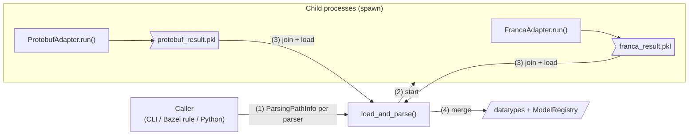

<!----
*******************************************************************************
Copyright (c) 2026 Contributors to the Eclipse Foundation

See the NOTICE file(s) distributed with this work for additional
information regarding copyright ownership.

This program and the accompanying materials are made available under the
terms of the Apache License Version 2.0 which is available at
https://www.apache.org/licenses/LICENSE-2.0

SPDX-License-Identifier: Apache-2.0
*******************************************************************************
-->

# Orchestrator

Runs the model tooling around the ECU model. Today it runs all available IDL parsers in parallel and merges their
results into one ECU model; generators and other model-related steps may follow.

Currently orchestrated parsers:

| Parser | Input | Adapter |
| --- | --- | --- |
| [Franca](../parsers/franca_parser) | `.fidl` / `.fdepl` files | [`FrancaAdapter`](franca_adapter.py) |
| [Protobuf](../parsers/protobuf_parser) | `protoc` descriptor sets | [`ProtobufAdapter`](protobuf_adapter.py) |

## Architecture



1. The caller describes the input files of each parser with a `ParsingPathInfo` (`src_files`,
   `dependency_files`). Parsers without source files are skipped.
2. Each parser runs in its own child process. The `spawn` start method gives every child a fresh interpreter, so its
   `ModelRegistry` starts empty.
3. A child writes exactly one pickle into a temporary directory, either
   `{"datatypes": ..., "registry": ...}` or `{"error": ...}`. Datatypes and registry are pickled as one object, so
   references between them stay intact. Result files are used instead of IPC queues, since parse results can be large.
4. The main process joins the children, loads the pickles and
   - raises `RuntimeError` naming every failed parser,
   - raises `ValueError` if a fully qualified name is defined by more than one parser,
   - otherwise merges all datatypes into one dict and adds all model elements via `ModelRegistry.merge()`.

## Modules

- [`common.py`](common.py): `ParsingPathInfo` and the `Parser` base class of all adapters.
- [`franca_adapter.py`](franca_adapter.py), [`protobuf_adapter.py`](protobuf_adapter.py): adapters to the parsers.
- [`load_dispatch.py`](load_dispatch.py): `load_and_parse()`, process handling and merging.
- [`run_load_dispatch.py`](run_load_dispatch.py): command line entry point.
- [`ecu_model_parse.bzl`](ecu_model_parse.bzl): Bazel rule wrapping the command line entry point.

## Usage

### Bazel rule

```starlark
load("//score/orchestrator:ecu_model_parse.bzl", "ecu_model_parse")

ecu_model_parse(
    name = "my_model",
    franca_srcs = ["my_service.fdepl"],
    franca_deps = ["my_types.fidl", "//path/to:deployment_specs"],
    protobuf_deps = [":my_proto"],  # proto_library targets, transitive descriptor sets are included
    log_level = "INFO",  # default WARNING
)
```

The rule writes `{"datatypes": ...}` to `my_model.pkl`. See [`test/BUILD`](test/BUILD) for a complete example.

### Command line

```bash
bazel run //score/orchestrator:run_load_dispatch -- \
    --franca-src $PWD/my_service.fdepl --franca-dep $PWD/my_types.fidl \
    --descriptor-set $PWD/my_proto.pb \
    --output /tmp/model.pkl --log-level DEBUG
```

### Python

```python
from score.orchestrator.common import ParsingPathInfo
from score.orchestrator.load_dispatch import load_and_parse

datatypes = load_and_parse(
    franca=ParsingPathInfo(src_files=(root_fidl,), dependency_files=(imported_fidl,)),
    protobuf=ParsingPathInfo(src_files=(descriptor_set,)),
)
```

## Dependency files

Franca only parses dependency files reachable via imports from the source files. Protobuf parses all descriptor sets
together; `ecu_model_parse` passes the transitive descriptor sets of `protobuf_deps`.

## Logging

All logging uses the standard `logging` module and is configured by the caller only.

- `Parser.run()` logs the start (number of input files, file list on `DEBUG`) and the end (duration, number of created
  model elements) of every parser.
- Spawned children inherit no logging configuration. They send all records through a queue to the main process, which
  re-emits them through the logger of the same name, so its levels and handlers apply.
- `load_and_parse()` logs the total duration after merging.

## Adding a parser

1. Implement a subclass of `Parser` in a new adapter module: set `name` and implement `parse()`, returning the
   datatypes by fully qualified name. Model elements created while parsing are shipped to the main process
   automatically.
2. Add a keyword argument for its `ParsingPathInfo` to `load_and_parse()` and add the adapter to its candidates.
3. Extend [`run_load_dispatch.py`](run_load_dispatch.py) and [`ecu_model_parse.bzl`](ecu_model_parse.bzl) with the
   new inputs.

## Known limitations

- Two Protobuf files with the same import path (e.g. two `consumer.proto` from different `proto_library` targets
  using `strip_import_prefix`) cannot be parsed in one run: `duplicate file name`.
- Starting a child with `spawn` costs a few hundred milliseconds, which dominates for small inputs.
